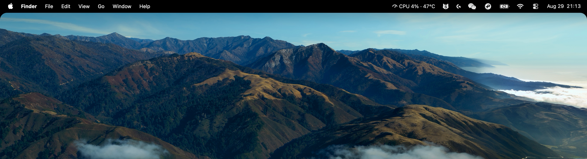
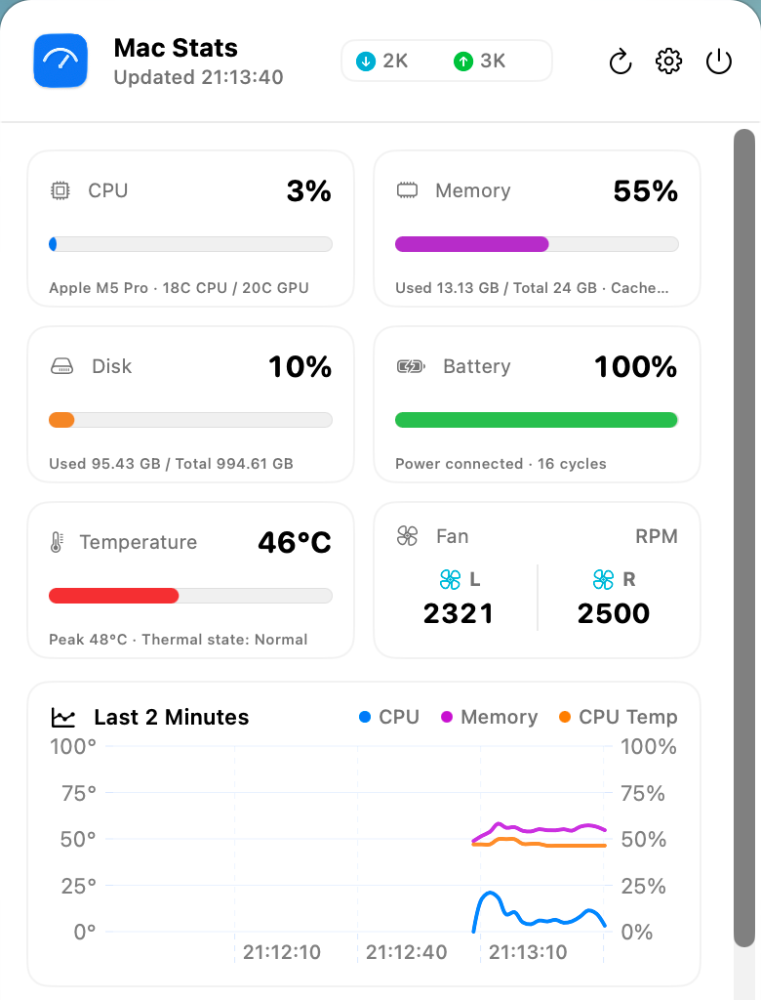

# Mac Stats

A lightweight, native macOS menu bar utility to hide the notch, monitor your system, and refine your desktop.

[Website](https://macstats.justbro.ai/en) · [Download](https://github.com/okzhangyida/mac-stats/releases/latest) · [简体中文](README.zh-CN.md)

## Make your menu bar feel at home

Blend the MacBook notch into a dark menu bar and add adjustable rounded desktop corners. On displays without a notch, use the same feature as a dark menu bar.

## Your Mac, at a glance

View CPU, memory, disk capacity, network activity, battery status, temperature, and fan speeds in one dashboard. Keep up to two metrics in the menu bar, explore recent trends, and find processes using the most CPU or memory.

- Native interface with English and Simplified Chinese support.
- Light, dark, and system appearance modes.
- Adjustable refresh interval and optional launch at login.
- Support for Apple silicon and Intel Macs; sensor availability varies by model.
- Static and traditional Dynamic Desktop wallpapers, with multi-display support. Aerial and video wallpapers are not supported.

## Download and install

Requires **macOS 13 or later**. Download the Universal DMG from the [website](https://macstats.justbro.ai/en) or [GitHub Releases](https://github.com/okzhangyida/mac-stats/releases/latest), open it, and drag **Mac Stats** into **Applications**.

Official downloads are Developer ID signed and notarized by Apple.

## Privacy

System readings, process information, and wallpaper data stay on your Mac. No account, ads, or personal tracking. Basic identifier-free usage statistics are enabled by default and can be disabled in Settings. See the [privacy policy](PRIVACY.md).

## Contributing and support

For source builds and signing instructions, see [Development](docs/DEVELOPMENT.md). Report bugs through Issues; contact [support@justbro.ai](mailto:support@justbro.ai) for support or private security reports.

## License and acknowledgments

Developed by Zhang Yida · [JustBro](https://macstats.justbro.ai/en).

Licensed under [GNU GPL v3.0 or later](LICENSE).

**This product was developed using OpenAI Codex.**
